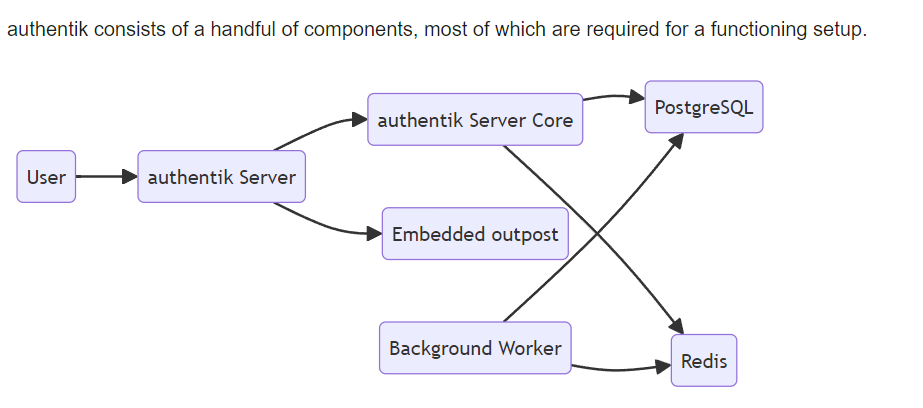
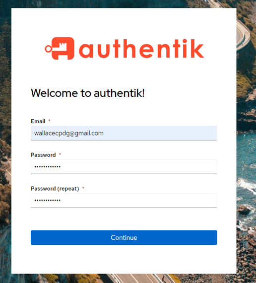

# Authentik

Authentik é uma plataforma de identidade e autenticação de código aberto projetada para gerenciar identidades, autenticação única (SSO), e fluxos de autenticação personalizados. Ele permite a integração com diversos provedores de autenticação e serviços, oferecendo uma solução flexível e segura para gerenciar acessos em ambientes corporativos e aplicações. Com uma arquitetura modular e fácil de implementar, Authentik facilita o gerenciamento centralizado de usuários e políticas de acesso.

## Arquitetura


## Pré-requisitos
* Docker

## Como destravar os pré-requisitos?
### Instalação do Docker
https://www.youtube.com/watch?v=pRFzDVn40rw&list=PLbPvnlmz6e_L_3Zw_fGtMcMY0eAOZnN-H

## Como baixar o projeto?
```
git clone https://github.com/wlcamargo/authentik
```

## Como rodar o authentik?
Entre na pasta do projeto
```
cd authentik
```

Execute o comando para baixar imagens e rodar containers
```
sudo docker compose up -d
```

## Primeiro acesso ao Authentik
http://localhost:7000/if/flow/initial-setup/

sample:


## Como acessar o Authentik?
localhost:7000

Para ver um exemplo de uso da ferramenta, acesse o tutorial na pasta ```docs```

## Referências
https://docs.goauthentik.io/docs

https://github.com/goauthentik/authentik

## Developer
| Desenvolvedor      | LinkedIn                                   | Email                        | Portfólio                              |
|--------------------|--------------------------------------------|------------------------------|----------------------------------------|
| Wallace Camargo    | [LinkedIn](https://www.linkedin.com/in/wallace-camargo-35b615171/) | wallacecpdg@gmail.com        | [Portfólio](https://wlcamargo.github.io/)   |
