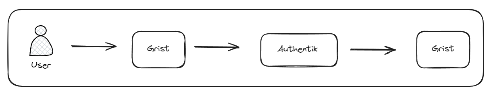
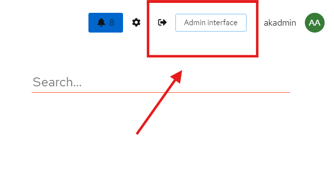
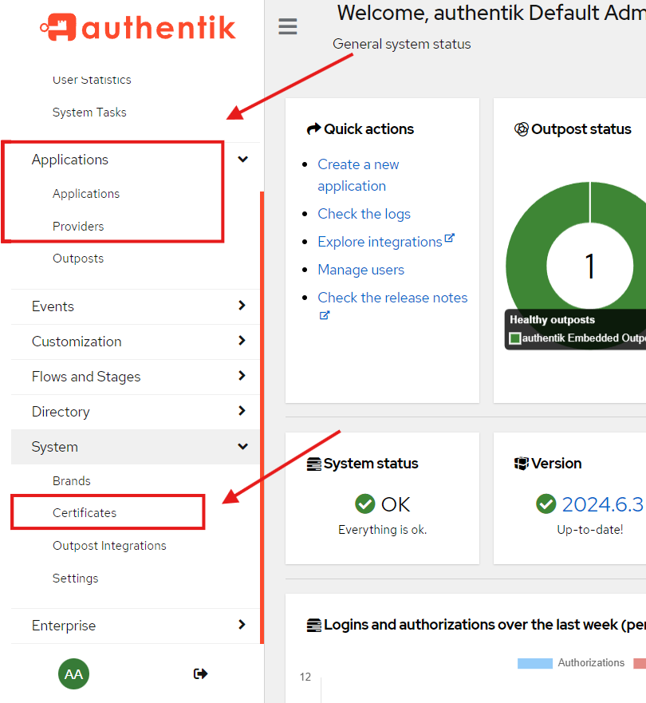
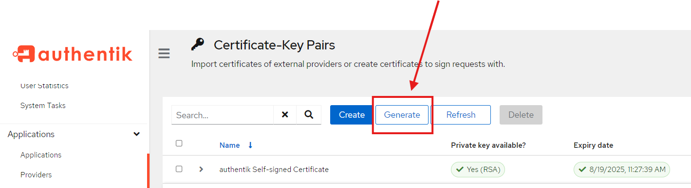
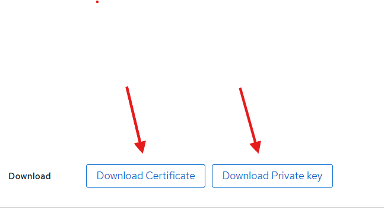
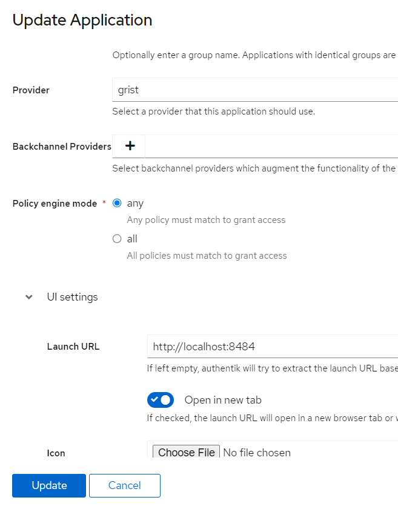
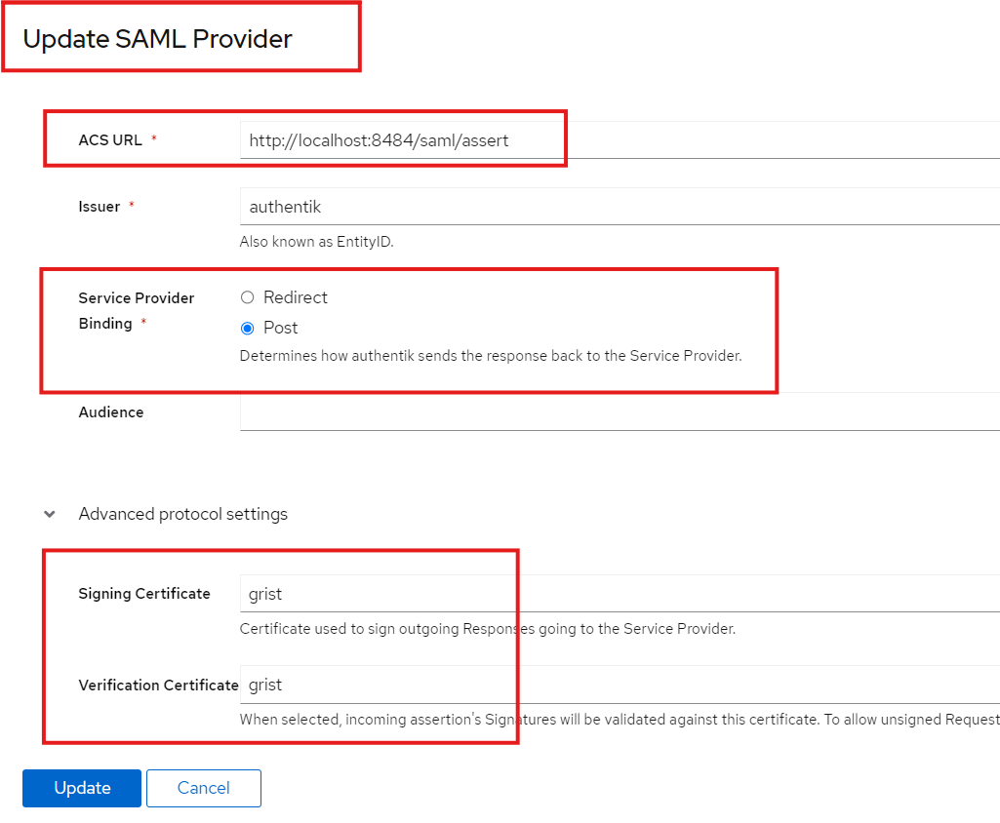
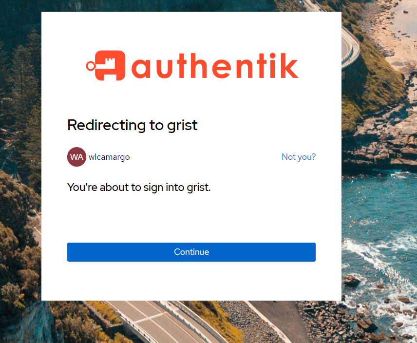
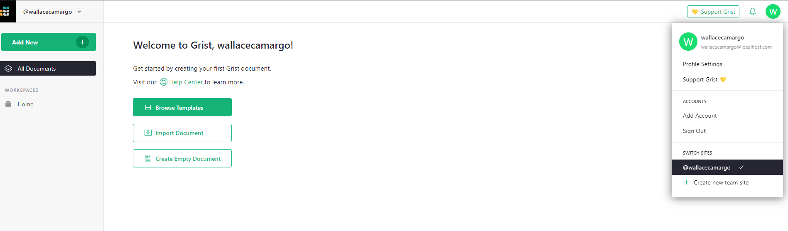

# Tutorial Authentik
Neste exemplo utilizamos uma aplicação de planilhas eletrônicas chamada ```Grist``` para exemplificar o acesso com o ```Authentik```.

Segue o link do vídeo de referência utilizado nesse tutorial: https://www.youtube.com/watch?v=BHtL3Gvn31o&t=1066s

## Arquitetura do exemplo



## Como autorizar uma aplicação?
Será necessário realizar 3 etapas, sendo elas: 

1 - Criar certificado

2 - Criar provider

3 - Criar application.

Acesse pelo modo de admin:


Opções que iremos utilizar no modo de admin:

* Certificates
* Applications
* Provider




### Criar certificado
Gere o certificado e depois exporte. 






!!! Warning
Esse par de chaves será utilizado para acesso a aplicação.

### Criar aplicação
Aqui você vai mapear qual o serviço que deseja acessar pelo Authentik.



## Criar provider
Neste exemplo, vamos utilizar um provedor SAML.



sample link provider:
```
http://localhost:8484/saml/assert
```

## Como autorizar um user?

Na opção ```User```, crie um usuário e atribua uma senha.

## Como rodar o Grist?

Adicione o par de chaves na pasta ```grist/persist```

Execute o comando:
```
docker run --rm --name grist-saml-service --env DEBUG=1 -p 8484:8484 \
	--env GRIST_SAML_SP_HOST=http://localhost:8484 \
	--env GRIST_SAML_IDP_LOGIN=https://localhost:9443/application/saml/grist/sso/binding/redirect/ \
	--env GRIST_SAML_IDP_LOGOUT=https://localhost:9443/if/session-end/grist/ \
	--env GRIST_SAML_IDP_UNENCRYPTED=1 \
	--env GRIST_SAML_SP_KEY=/persist/grist_private_key.pem \
	--env GRIST_SAML_SP_CERT=/persist/grist_certificate.pem \
	--env GRIST_SAML_IDP_CERTS=/persist/grist_certificate.pem \
	-v $PWD/persist:/persist -it gristlabs/grist
```

## Acessar o Grist via Authentik
locahost:8484

Quando clicar em login ele vai pedir o user e senha do Authentik, depois e informar, ele vai pedir para continuar.



Se estiver tudo certo, ele vai logar na tua aplicação Grist, já com o user do Authentik.



